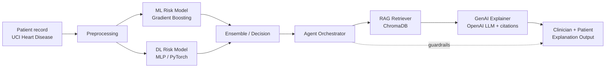

# Integrative Industry Synthesis — Clinical Triage & Risk Decision Support

Industry-focused AI system that integrates classical ML, deep learning, RAG, generative AI, and an agentic orchestrator for cardiovascular risk triage and clinician-facing explanation.

> Educational artifact only. Not for clinical use. Uses public, de-identified UCI data.

## Architecture



## Prior-project domains integrated

| # | Domain | Component |
|---|---|---|
| 1 | Data + Classical ML | Tabular risk classifier |
| 2 | Deep Learning | PyTorch MLP scorer |
| 3 | Generative AI + RAG | LLM explainer grounded in retrieved evidence |
| 4 | Agentic AI | Orchestrator with refusal/guardrail logic |

## Folder layout

```
Intgerated AI Systems/
├── data/                  # raw + processed datasets (gitignored)
├── knowledge_base/        # source docs for RAG
├── models/                # trained model artifacts (gitignored)
├── notebooks/             # exploration + integrated pipeline
├── src/                   # library code
│   ├── rag/
│   └── ...
├── tests/                 # smoke tests
├── diagrams/              # exported architecture images
├── docs/                  # synthesis paper + presentation outline
├── requirements.txt
└── .env.example
```

## Setup

```powershell
python -m venv .venv
.\.venv\Scripts\Activate.ps1
pip install -r "Intgerated AI Systems/requirements.txt"
Copy-Item "Intgerated AI Systems/.env.example" "Intgerated AI Systems/.env"
# edit .env and set OPENAI_API_KEY
```

## Run

End-to-end demo notebook: `notebooks/05_integrated_pipeline.ipynb`.

## Author

Naunihal Singh Sidhu — nssidhu@yahoo.com
