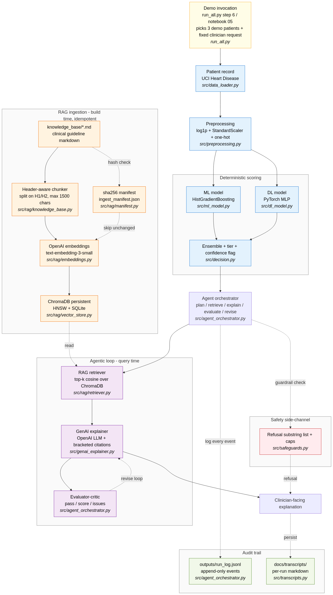

# Integrative Industry Synthesis - Clinical Triage and Risk Decision Support

Industry-focused AI system that integrates classical ML, deep learning, RAG, generative AI, and an agentic orchestrator for cardiovascular risk triage and clinician-facing explanation.

> **Educational artifact only. Not for clinical use.** Uses public, de-identified UCI data (Janosi et al., 1988).

## Architecture



The same diagram is also embedded in `notebooks/05_integrated_pipeline.ipynb` (mermaid, renders on GitHub) and described in prose in `docs/Reflective_Synthesis_Paper.md` sections 2-3.

## Prior-project domains integrated

| Prior project | Concept reused | Where it lives |
|---|---|---|
| **P2** Data and statistics | IDA discipline, chi-square / Cramer's V, limitations framing | `notebooks/01_data_exploration.ipynb` |
| **P3** Machine learning | sklearn `Pipeline` + `ColumnTransformer`, `log1p` | `src/preprocessing.py`, `src/ml_model.py` |
| **P4** Deep learning | Fixed-seed PyTorch loop, dropout, per-slice eval | `src/dl_model.py`, `src/evaluation.py` |
| **P5** Generative AI | Responsible-framing of generative output, mandatory disclaimer | `src/genai_explainer.py` |
| **P6** Agentic AI | plan -> retrieve -> explain -> evaluate -> revise loop, refusal list, run log | `src/rag/`, `src/agent_orchestrator.py`, `src/safeguards.py` |

## Folder layout

```
Intgerated AI Systems/
├── data/                  # raw + processed datasets (gitignored)
├── knowledge_base/        # source markdown for RAG
├── models/                # trained model artifacts (gitignored)
├── notebooks/             # 5 numbered notebooks, all executed in-place
├── src/                   # library code (rag/, models, orchestrator, ...)
├── tests/                 # smoke tests (17 pass, incl. 3 live API)
├── docs/                  # synthesis paper (md + PDF), presentation outline,
│                          # architecture.png, transcripts/, integration_map.md
├── outputs/               # run_log.jsonl (gitignored, append-only)
├── chroma_db/             # vector store (gitignored)
├── run_all.py             # single-file end-to-end orchestrator
├── requirements.txt
└── .env.example
```

## Setup

```powershell
python -m venv .venv
.\.venv\Scripts\python.exe -m pip install -r "Intgerated AI Systems/requirements.txt"
Copy-Item "Intgerated AI Systems/.env.example" "Intgerated AI Systems/.env"
# edit .env and set OPENAI_API_KEY
```

> **Install caveat — do NOT use `pip install --quiet -r requirements.txt`.** With `--quiet`, pip silently dropped ~38 of the 172 pinned packages (including `chromadb`) during testing on a fresh venv, and the pipeline failed with `ModuleNotFoundError: No module named 'chromadb'`. Re-running the same command **without** `--quiet` installs all 172 cleanly in one shot and `pip check` reports no issues. If you see import errors after install, simply re-run `pip install -r requirements.txt` without flags.

## Reproduce - one command

```powershell
cd "Intgerated AI Systems"
python run_all.py                            # full end-to-end (~3 min, ~9-12 OpenAI calls)
python run_all.py --skip-train               # reuse models on disk (still runs demos)
python run_all.py --skip-demo                # skip live agent demos (no API calls)
python run_all.py --skip-train --skip-demo   # fastest dry-run, ~15 s, no API
```

### What each step does and when it is reused

`run_all.py` runs six steps in dependency order. Each step is independently re-entrant; the table below shows what is executed vs. reused under each flag combination, and where you can visually inspect what each step produced.

| # | Step | What it does | Outputs (visually inspect these) | Default | `--skip-train` | `--skip-demo` | both flags |
|---|---|---|---|---|---|---|---|
| 1 | Load UCI Heart Disease | Downloads on first run; reads cached CSV on later runs | `data/raw/heart_disease.csv` | execute (cached) | execute (cached) | execute (cached) | execute (cached) |
| 2 | Train ML + DL | `HistGradientBoostingClassifier` 5-fold CV; PyTorch MLP 80 epochs | `models/ml_model.joblib`, `models/dl_model.pt`, `models/dl_model_meta.pt` | **train** | **reuse from disk** | **train** | **reuse from disk** |
| 3 | KB ingest into ChromaDB | sha256 manifest; only re-embeds changed files. Default no-op returns `chunks_added=0` | `chroma_db/chroma.sqlite3`, `chroma_db/<uuid>/{data_level0,header,length,link_lists}.bin`, `chroma_db/ingest_manifest.json` | execute (idempotent) | execute (idempotent) | execute (idempotent) | execute (idempotent) |
| 4 | Score test cohort | Ensembles ML + DL probabilities; assigns tier (low/moderate/high); flags low-confidence rows | printed to stdout (tier counts); per-row scoring is in-memory, surfaced inside demo transcripts | execute | execute | execute | execute |
| 5 | Aggregate metrics | ROC-AUC, PR-AUC, Brier, per-sex slice table for both models | printed to stdout; also re-rendered in `notebooks/04_evaluation.ipynb` | execute | execute | execute | execute |
| 6 | Three live agent demos | `happy_path`, `low_confidence`, `refusal` — calls OpenAI live | `docs/transcripts/{label}_{run_id}.md` (3 new files per run) and appended events in `outputs/run_log.jsonl` | **execute (~9 API calls)** | **execute (~9 API calls)** | **skip** | **skip** |

**Quick visual inspection cheat-sheet:**

```powershell
# Latest model artifacts (sizes confirm training happened)
Get-ChildItem models -Filter "*.joblib","*.pt" | Format-Table Name, Length, LastWriteTime

# Most recent transcripts (3 newest = the just-completed run)
Get-ChildItem docs/transcripts -Filter "demo*.md" | Sort-Object LastWriteTime -Descending | Select-Object -First 6 Name, LastWriteTime

# Tail the append-only run log
Get-Content outputs/run_log.jsonl -Tail 20

# Vector store state
Get-ChildItem chroma_db -Recurse -File | Format-Table FullName, Length

# Cached dataset
Get-Item data/raw/heart_disease.csv | Select-Object Name, Length, LastWriteTime
```

**Timing (approx., on commit `7233b15`):**

| Mode | Wall time | OpenAI calls | Use case |
|---|---|---|---|
| `python run_all.py` | ~3 min | ~9-12 | Full reproduction from scratch |
| `python run_all.py --skip-train` | ~50 s | ~9-12 | Quick re-verification with committed models |
| `python run_all.py --skip-demo` | ~3 min | 0 | Train models, no API spend |
| `python run_all.py --skip-train --skip-demo` | ~15 s | 0 | Smoke test, no API, no training |

## Reproduce - notebook-by-notebook

If you prefer to walk through individual notebooks (recommended for the mentor defense):

| Order | Notebook | Purpose |
|---|---|---|
| 1 | `notebooks/01_data_exploration.ipynb` | IDA, chi-square / Cramer's V, dataset limitations |
| 2 | `notebooks/02_ml_risk_model.ipynb` | ML training + ROC/PR + per-slice metrics |
| 3 | `notebooks/03_dl_risk_model.ipynb` | DL training + curves + per-slice metrics |
| 4 | `notebooks/04_evaluation.ipynb` | Aggregate metrics, slice tables, RAG faithfulness, failure cases |
| 5 | `notebooks/05_integrated_pipeline.ipynb` | End-to-end demo, three live agent runs, persisted transcripts |

Notebooks 04 and 05 require model artifacts on disk; run 02 and 03 first if `models/` is empty.

## Tests

```powershell
python -m tests.test_evaluation         # unit tests, fast, no API
python -m tests.test_genai_explainer    # live API, ~1 OpenAI call
python -m tests.test_agent_orchestrator # live API, ~3 OpenAI calls
# ... etc.
```

All 17 tests pass with the venv pinned in `requirements.txt`.

## Re-run resilience

The pipeline is **safe to re-run**:

| Component | Behaviour on re-run |
|---|---|
| `data_loader.load_heart_disease` | Cached to `data/raw/heart_disease.csv` after first download. Idempotent. |
| `ml_model.save` / `dl_model.save` | Overwrite the same artifact. Training is deterministic (seed=42), so re-runs produce identical artifacts. |
| `rag.retriever.ingest()` | Idempotent via sha256 manifest at `chroma_db/ingest_manifest.json`. Only re-embeds files whose content changed. Returns `{changed_files: [], chunks_added: 0}` on a clean re-run. Use `ingest(force=True)` to wipe and rebuild. |
| `agent_orchestrator.run` | Each call generates a fresh `run_id` (uuid). `outputs/run_log.jsonl` is **append-only**. `docs/transcripts/{label}_{run_id}.md` produces a new file per run; previous transcripts are preserved. |

### How to differentiate runs

Every run carries two distinguishing fields:

- **`run_id`** - 8-char uuid prefix (e.g. `3fe8154e`). Appears in:
  - the transcript filename: `docs/transcripts/demo1_happy_path_3fe8154e.md`
  - every record in `outputs/run_log.jsonl`
  - the `Run transcript` header inside the markdown
- **`ts`** - ISO 8601 timestamp on every event in `run_log.jsonl`, and a `timestamp` field at the top of each transcript

To find the latest run:

```powershell
# newest transcripts
Get-ChildItem docs/transcripts -Filter "demo*.md" | Sort-Object LastWriteTime -Descending | Select-Object -First 6

# events for a specific run_id from the log
python -c "import json; [print(json.dumps(r, indent=2)) for r in (json.loads(l) for l in open('outputs/run_log.jsonl', encoding='utf-8')) if r.get('run_id') == '3fe8154e']"
```

If transcripts pile up over many runs, you can safely delete `docs/transcripts/demo*.md` between runs - they are regenerated on the next `run_all.py` invocation. The `.gitkeep` file preserves the directory.

## Deliverables for Project 7 submission

| Required by rubric | Where |
|---|---|
| Integrated industry artifact | `notebooks/05_integrated_pipeline.ipynb`, `run_all.py`, all of `src/` |
| Reflective Synthesis Paper (PDF, 1,500-2,000 words) | [`docs/Reflective_Synthesis_Paper.pdf`](docs/Reflective_Synthesis_Paper.pdf) |
| Architecture diagram | [`docs/architecture.png`](docs/architecture.png) (also rendered inline in `notebooks/05_integrated_pipeline.ipynb`) |
| Supporting code, notebooks, diagrams | `src/`, `notebooks/`, `tests/`, `docs/` |
| `requirements.txt` (from `pip freeze`) | `requirements.txt` |
| Mentor presentation script | [`docs/presentation_outline.md`](docs/presentation_outline.md) |

## Author

Naunihal Singh Sidhu - nssidhu@yahoo.com
